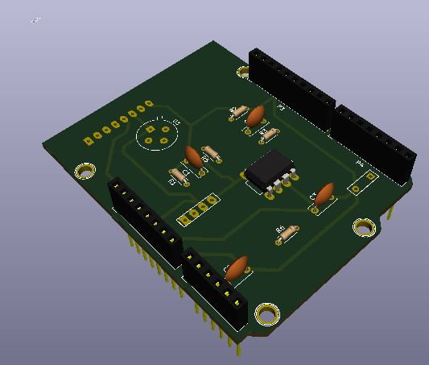
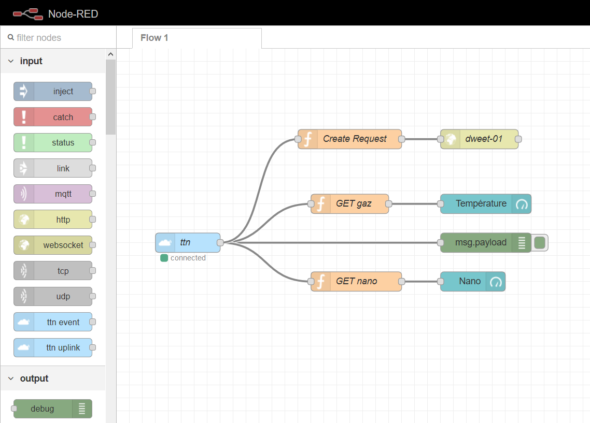
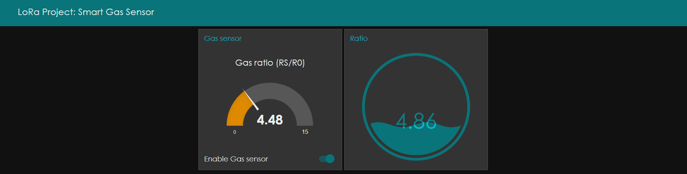
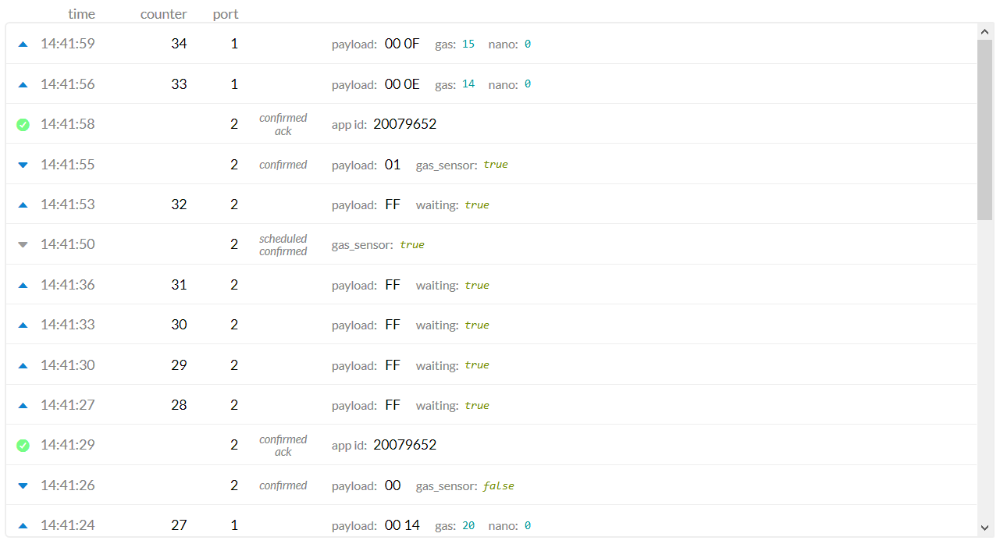
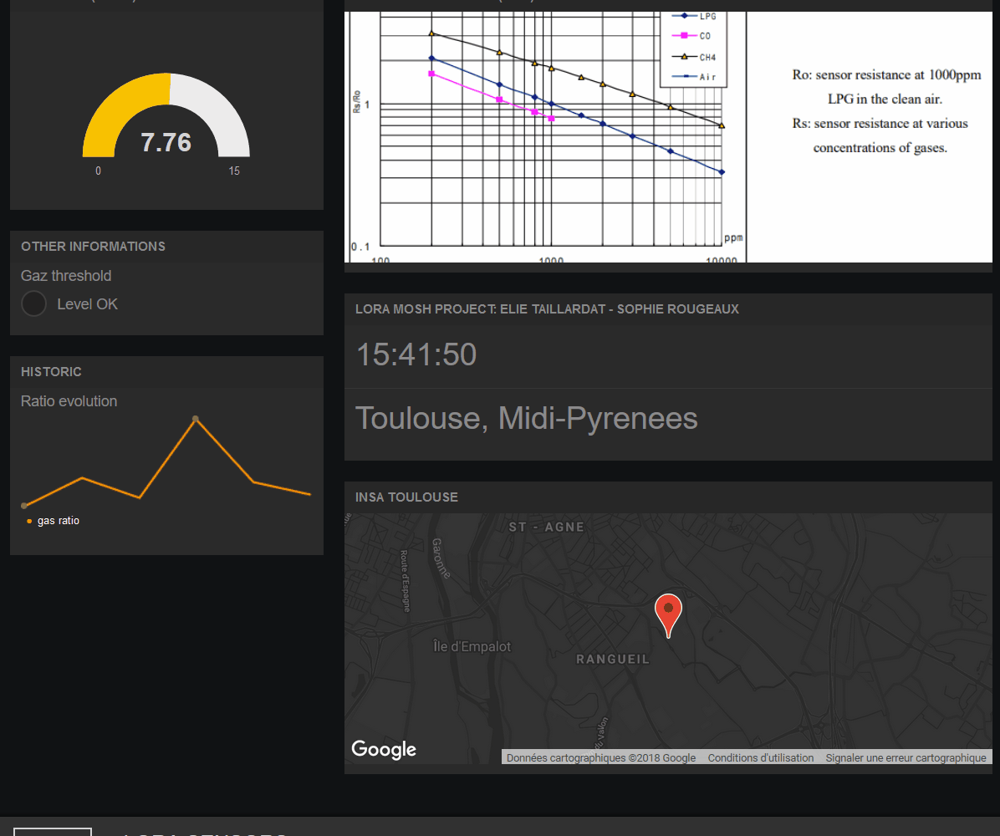

# LoRa Project: Smart Gas Sensor
> Elie Taillardat & Sophie Rougeaux

##### *Key-words:* ```Arduino``` ```KiCad``` ```The Thing Network``` ```LoRa``` ```Node-RED``` ```IoT``` ```Gas sensor```

This project is realized in the 5th year PTP ISS at INSA Toulouse.
A **LoRa-connected gas sensor** has been developed to alert the user about the concentration of health threatening gas near the sensor.

# Content

This repository contains :
- **KiCad PCB Files**: A shield for the gas sensor to plug on an Arduino Uno (made with [KiCad](http://kicad-pcb.org/))
- **Arduino Code**: The code for the microcontroler (using [Arduino IDE](https://www.arduino.cc/en/Main/Software))
- **Node-RED Dashboard**: The HMI, to stay connected with your sensor ([Node-RED](https://nodered.org/) and [Freeboard.io](https://freeboard.io/))


## KiCad PCB Files
### Overview
The shield is composed of :
- A home-made gas sensor (made at [AIME](https://www.aime-toulouse.fr/cmsms/index.php))
- A amplifier stage for home-made gas sensor
- A commercial gas sensor for the calibration of the home-made one (Grove connectors)
- The LoRa chip for the data transmission
- A LED as a threshold exceeded indicator

> We built our own footprints libraries expect for the Arduino Uno component

### Layout
These parameters have been respected to respect the INSA PCB production capacity :
|Parameters|Value|
|--|--|
|Isolation|0.4|
| Largeur piste | 0.8 |
|Diamètre Via|1.6|
|Perçage Via|0.8|

### 3D Model



> KiCad-Pcbnew-Affichage-3D Visualizer

## Arduino Code

## Node-Red Dashboard
### TTN data payload
Data sent by the **Arduino board** through **LoRa network** are decoded thanks to our ```Decoder``` function that we precised in the *Payload Format* section on TTN, which allows to generate an understandable payload with the bytes received, as ```json``` format for instance.
Our ```Decoder``` is presented below:
```javascript
function Decoder(bytes, port) {
  // Decode an uplink message from a buffer
  if (port === 2) { // send via the dashboard to stop gas sensor, see next chapter
    return { waiting: true };
    
  } else if (port === 1) {
    var gas = (bytes[0] << 8) | bytes[1];       // value between 0 and 1024
    var nano = (bytes[2] << 8) | bytes[3];
    
    // transform into readable data
    var gas_volt = gas / 1024 * 5.0;
    var gas_ratio = (5.0 - gas_volt)/gas_volt;  // see datasheet for the calculation
    var R0 = 9.3;                               // sensor resistance at 1000ppm LPG in the clean air
    return {
      gas: (gas_ratio/R0).toFixed(2),
      nano: nano
    };
  }
}
```
> We code the ```nano``` variable in prevision of the future nano-particules sensor that we will design at AIME). For now it is useless.

And the result for a simulated uplink payload on port 1: ``` 02 BE 01 F5 ```
```json
{
  "gas": 7.02,
  "nano": 5.01
}
```

### Node-RED
Once the payload is well interpreted in TTN, we use the tool **Node-RED** built on Node.js, to deal with our data and then display them in a dashboard for user consultation.



We use a ``` ttn uplink ``` node linked to our application (```App ID: 20079652```) and registered device (```Device ID: arduino_gaz_sensor```). When a data is received, we can observe in the **debug** console the ```json``` payload received (output of the debug node, cf. picture above in the right panel). Therefore we received the payload as expected.
The dashboard compiled is shown below:



As we can see, **we add a switch to control the state of the gas sensor remotely**.
When switched off for example, the payload sent in the ```ttn downlink``` node looks like:
```json
{
  "gas_sensor": false,
}
```

Then our Encoder on TTN sends to the Arduino board a bytes payload ```00``` or ```01``` (on port 2 or 3):
```javascript
function Encoder(object, port) {
  // Encode downlink messages sent as
  // object to an array or buffer of bytes.
  var bytes = [];
  if (port === 2) bytes[0] = object.gas_sensor ? 1 : 0;
  if (port === 3) bytes[0] = object.nano_sensor ? 2 : 0;

  return bytes;
}
```

When we simulate this behavior in real time, we can see the expected result on the TTN console output, and the LED switched off on our Arduino board:



> Here, we can see that when switched off, the Arduino board stops sending data and is in a *waiting* mode. Once we switched on, the data are sent and received again.

### Freeboard.io
In addition to the localhost Node-RED dashboard we created, we prefered to use also Freeboard.io, to access the interface anywhere, and not only on our laptop localhost (http://127.0.0.1:1880/ui/).
That's the aim of the dweet node, which transfers the payload to a specific **topic**, that we will use in our freeboard dashboard.

**Dashboard link:
https://freeboard.io/board/Wauqxs**

> The curve allows the user to interpret the Gas ratio, and obtain a value in **ppm** of the gas concentration.




## Contact
- Elie Taillardat: taillard@etud.insa-toulouse.fr
- Sophie Rougeaux: rougeaux@etud.insa-toulouse.fr
